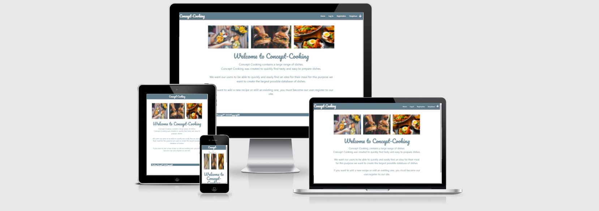

# Milestone-Project-3 : Find a MMA GYM

 __[Live Webpage]()__
# Introduction

Concept-Cooking was created to quickly find large database tasty and easy to prepare dishes.

This is my third milestone on my Code Institute course, in which I was given the instructions to make an Backend Development Project.

I'm thankful for you all visiting my project. If you have any suggestions, questions or feedback feel free to reach out to me on GitHub.

# UX

## Goals
* My project allows you to easily find a good testy meal.
* Create a website that allows you to easily and intuitively navigate through the website.
* The website have 3 categoris of recipes : Breakfast , Lunch and Dinner.
* My project will allow the register users to  add , edit , delete a  meals.

## User Stories

1. I am a user looking for a large database of meals.
2. I am a user I'm looking for a method how to cook a dish.
3. I am the user looking to find the ingredients to make a meal.
4. I am user looking for are looking for how long take me to prepare and cook a meal.

## Design Process

* I started my process of designing the project what functions would I like to be there, such as Home page, new recipe, profile, log in, register, view recipes Log out.

# Database

The application uses 3 database collections, 'categories', 'users' and 'recipes'.

The basic information of each recipe (category, name, image-link, method, preparation time, serves and cooking time) is stored as a key value whilst the content of the ingredients and instructions for each recipe and method are stored as an array.

The idea behind the array is to be able to better structure the output of the ingredients and instructions data in the recipe view.
This is achieved by the user segregating each ingredient/instruction in the add/edit recipe form using a line break (hit enter after each ingredient/instruction).
The user is instructed to do this via the placeholder text in the applicable textarea on the edit/add recipe page.

The textarea content is then split using "/n" and saved as an array in the database.
The reverse is applied "/n.join" to pre-populate the textarea form fields when editing a recipe.

The view recipe page applies a for each function to combine each array item into a collection of ingredients/method to the user.

# Wierframe
I use a  __[Uizard](https://app.uizard.io/)__  to make wireframes for the website, I created first a desktop version and after that, I make a large screens and mobile. 

You can find my mock-ups below:
* __[Home-page for large screens](static/images/wireframes/Home-page.png)__
* __[Home-page for Mobile](static/images/wireframes/Screen-Mobile.png)__
*  __[Logine screen](static/images/wireframes/Login.png)__
*  __[Registration screen](static/images/wireframes/Registration.png)__
* __[Recipies screen](static/images/wireframes/Recipe.png)__

# Features

## Navbar
* Navbar always sticks to the top of the page on devices with large screens.
* Navbar for mobile devices will transform to humburger icons on left side of screen.
* Navbar for not login users navbar have the logo of a website, home, login, registration and recipes.
* For users login nabar have home, add recipes, profile, log out and recipes.
## Home
* Brief information about the site and the possibility on it.

## Log In
* This page will allow registered user to login.
## Registration
* This page will allow the new user to register on the site. 
## Categories
* On this page, users will be allowed to see available recipes from  the category selected by the user . User on page will see a cards with a  picter of ready recpie , name , link to full view o recipie and 3 dots they will show a user more details (preperation , cooking time and number of serves)
## Recipie
* This page, user will see the name of the recipe picture are cooking formation about the preparation time and cooking time and for how many people you can serve this dish after clicking on the icon of ingredients user will see what will be used to make this dish, next icon will show user a method of cooking  , on bottom of the card will be edit option and delete option.
## Add recipe
* This page will allow login users to add the new recipes to a database on the page there will see a form with options selected category, picture of the dish, cooking time, serving ingredients user-specified press enter after every ingredient and it will be the same. On the bottom of the page will be two buttons submit and cancel. Update will update recipe to the database and cancel will redirect user to the homepage.
## Edit recipe
* This page will allow login users to edit existing recipes from a database on page there will see a form with options selected category, picture of the dish, cooking time, serving ingredients user-specified press enter after every ingredient and it will be the same.On the bottom of the page will be two buttons update and cancel update will update recipe to the database and cancel will redirect user to the homepage.
## Profile
* This page shows only a username is created only for allow to user at new recipes.

## Features to implement in future
 In the future I would like to add to the project:

* On the profile page I want recipes added by the user and favourite recipes of the user.
* Restriction of editing and delete only for registered users.
* Search all recipes by the name and ingredients.
* Adding the comments to the recipes.
* Scoring recipes by the stars.

****

# Technologies Used:
## Languages
*  __[HTML](https://en.wikipedia.org/wiki/HTML)__ 
*  __[CSS](https://en.wikipedia.org/wiki/CSS)__ 
*  __[JavaScript](https://www.javascript.com/)__ 
* __[Python](https://www.python.org/)__ 

## Libraries
* click 8.0.1
* dnspython 2.1.0
* Flask 2.0.1
* Flask-PyMongo 2.3.0
* itsdangerous 2.0.1
* pymongo 3.11.4
* Werkzeug 2.0.1

## Technologies
*  __[Uizard](https://app.uizard.io/)__
* __[MongoDB](https://cloud.mongodb.com/)__
*  __[Git](https://git-scm.com/)__ 
*  __[GitPod](https://www.gitpod.io/)__ 
*  __[W3C CSS Validation Service](https://jigsaw.w3.org/css-validator/)__ 
*  __[W3C HTML Validation Service](https://validator.w3.org/)__ 
*  __[HTML Formatter](https://codebeautify.org/htmlviewer//)__ 
* __[Online JavaScript Beautifier](https://beautifier.io/)__ 
* __[Bootstrap](https://getbootstrap.com/)__

# Testing

## Testing Devices

### Validating HTML5 and CSS3 code

# Deployment

## MongoDB
For the purpose of this project create a new database at mongo DB name cooking_book with three collections categories, recipes and users.
## GitHub
This project was deployed via GitHub by following these steps :
* Navigate to the repository on github and click Settings.
* From there, go to the Source section within the Github Pages section.
* Select master branch on the dropdown menu, and click save.
* The page will be available at this link __[Find a MMA Gym in Irleand](https://azimny86.github.io/Milestone-Project-2/)__.
****
## Heroku
This project was deployed via Heroku by following these steps :
* For this project I create new app on Heroku named flask-cooking-book 
* At the beginning in the settings we have to fill in "Config Vars" with IP , PORT, data base name , PORT , Mongo uri and ouer secret key
* From there,  clik deploy option.
* On Deployment method connect with GitHub and with my uzer on this servis
* Select Deploy Brench
* The page will be available at this link __[Cooking-Concet](https://flask-cooking-book.herokuapp.com/)__.
****
# Credits

## Content
All recipes are taken from the web page __[myfoodbook ](https://myfoodbook.com.au/)__ .